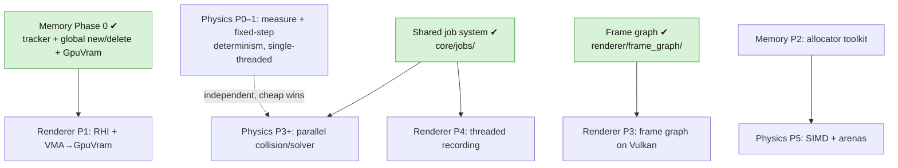

# Vulkyrie — Cross-Plan Roadmap

Sequencing for the architecture plans in this directory. They are deliberately interlocked: two shared
foundations underpin the rest, and after those the two big tracks are largely independent and can be
reordered by priority.

**Both shared foundations are now built.** Memory Phase 0 and the shared job system — the two hard
cross-dependencies this roadmap was originally written to sequence — are done, so the critical path
below is history rather than guidance. What remains is a straight choice between the two tracks.

## The plans

- [Physics performance & parallelism](physics-performance-parallelism-architecture.md) — optimize the
  existing rigid-body engine (fixed-step + determinism, job system, parallel collision/solver, SIMD).
- [Memory subsystem](memory-subsystem-architecture.md) — per-subsystem memory tracking, allocator
  toolkit, budgets, leak detection, HUD. **Phase 0 done.**
- [Vulkan renderer](vulkan-renderer-architecture.md) — multi-threaded Vulkan RHI behind a
  concepts-checked, compile-time-polymorphic backend seam; frame graph, render thread, stats/metrics.
  Scaffolding built, no Vulkan yet — see
  [phase-0 bring-up](vulkan-renderer-phase-0-bring-up.md).
- [Shared job system](shared-job-system-implementation-plan.md) — **done**; see
  [core/jobs/README.md](engine/include/core/jobs/README.md).
- [Frame graph](frame-graph-performance-and-correctness-plan.md) — **done**; see
  [frame_graph/README.md](engine/include/renderer/frame_graph/README.md).

## The two cross-dependencies (both satisfied)

These were the shared foundations everything else waited on. Both are now built, and are recorded here
because they still explain *why* the tracks are shaped the way they are.

1. **Shared job system** (`core/jobs/`) — required by physics parallelism (physics Phase 3+) **and** the
   renderer's threaded command recording (renderer Phase 4). **Built.** `FrameGraph::RecordParallel`
   already fans pass bodies across it; what it now waits on is a backend to record into.
2. **Memory tracker + `GpuVram` bucket** — the renderer's VMA allocator reports into it (renderer Phase
   1) and physics' per-frame arenas come from its allocator toolkit (physics Phase 5). **Phase 0 built.**

## Recommended order

Steps 1 and 2 of the original plan — Memory Phase 0, then the shared job system — are **done**. What
follows is the remaining sequence.

1. ~~**Memory — Phase 0**~~ (tracker + global `new`/`delete` override + `GpuVram` bucket enum). **Done.**
2. ~~**Shared job system**~~ (`core/jobs/`). **Done**, and independently load-tested by the frame graph's
   `RecordParallel` path.
3. **Physics track** — Phase 0 (measure) → Phase 1 (fixed-step / determinism / data-layout cleanup) →
   Phase 3 (parallel collision) → Phase 4 (modern solver) → Phase 5 (SIMD + adopt memory arenas). Ahead
   of the renderer because it is an **existing, working system**: lower risk, faster wins, and it
   **load-tests the job system and memory tracking on a contained workload**. *Physics Phases 0–1 are
   single-threaded and independent — pull them forward as cheap stability wins anytime.*
4. **Renderer track** — Phase 0 (Vulkan bring-up) → 1 (RHI real) → 2 (shaders) → 3 (frame graph on
   Vulkan) → 4 (threading) → 5 (stats) → 6+ (bindless, GPU-driven, PBR/shadows/post). The largest and
   highest-uncertainty effort. It needs the job system at Phase 4 and the `GpuVram` bucket at Phase 1 —
   both now available, so it is unblocked at every phase.
5. **Memory — Phases 2–5** (allocator toolkit, third-party hooks, budgets, HUD). Slot in incrementally as
   physics and the renderer start wanting arenas. Not on anyone's critical path.

## What would reorder this

The default (**physics before renderer**) is the lower-risk path. If the near-term goal is instead a
**visible, demoable modern engine**, swap steps 3 and 4 — the renderer track is unblocked at every phase,
so nothing structural prevents taking it first.

One consideration that did not exist when this roadmap was written: **the engine currently draws
nothing.** The pre-pivot OpenGL renderer is in `backup/`, both backend `Context` implementations are
stubs, and `RendererImpl<B>::Render()` is a no-op — every target builds and runs, but there is no render
path. If having a picture on screen matters in the near term, that argues for the renderer track, and
for treating "restore a working render path for editor/sandbox" as its own scheduled item rather than
something a renderer phase will pick up for free.

## Where things stand, in one line

**Both shared foundations are built; physics and renderer are independent tracks, sequenced by
priority.**
