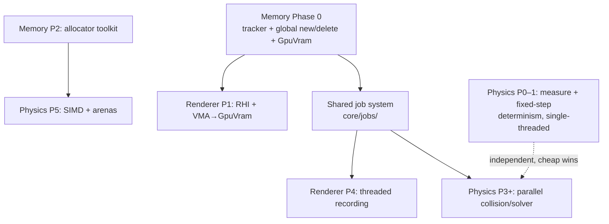

# Vulkyrie — Cross-Plan Roadmap

Sequencing for the three architecture plans in this directory. These plans are deliberately
interlocked: two shared foundations underpin the rest, and after those the two big tracks are
largely independent and can be reordered by priority.

## The plans

- [Physics performance & parallelism](physics-performance-parallelism-architecture.md) — optimize the
  existing rigid-body engine (fixed-step + determinism, job system, parallel collision/solver, SIMD).
- [Memory subsystem](memory-subsystem-architecture.md) — per-subsystem memory tracking, allocator
  toolkit, budgets, leak detection, HUD.
- [Vulkan renderer](vulkan-renderer-architecture.md) — greenfield multi-threaded Vulkan RHI + backend,
  frame graph, render thread, stats/metrics.

## The two hard cross-dependencies

Everything else is independent enough to reorder; these two are shared foundations that multiple
plans build on, so they come first.

1. **Shared job system** (`core/jobs/`) — required by physics parallelism (physics Phase 3+) **and**
   the renderer's threaded command recording (renderer Phase 4). Defined as physics Phase 2, but it
   is generic engine infra, not physics-specific.
2. **Memory tracker + `GpuVram` bucket** — the renderer's VMA allocator reports into it (renderer
   Phase 1) and physics' per-frame arenas come from its allocator toolkit (physics Phase 5). Memory
   Phase 0 is small and self-contained.

## Recommended order

1. **Memory — Phase 0** (tracker + global `new`/`delete` override + `GpuVram` bucket enum).
   Small and self-contained; gives allocation visibility for everything after. **Do it first to
   de-risk the one real build hazard early — the static-library `operator new` linker drop** (see the
   memory plan's whole-archive/anchor mitigation).
2. **Shared job system** (`core/jobs/`). The keystone — unblocks both big parallel efforts and is
   independently testable. Build once, correctly.
3. **Physics track** — Phase 0 (measure) → Phase 1 (fixed-step / determinism / data-layout cleanup)
   → Phase 3 (parallel collision) → Phase 4 (modern solver) → Phase 5 (SIMD + adopt memory arenas).
   Before the renderer because it is an **existing, working system**: lower risk, faster wins, and it
   **load-tests the job system and memory tracking on a contained workload** before the greenfield
   renderer relies on them. *Physics Phases 0–1 are single-threaded and independent — pull them
   forward as cheap stability wins anytime.*
4. **Renderer track** — Phase 0 (bootstrap) → 1 (RHI + VMA) → 2 (shaders) → 3 (frame graph) →
   4 (threading) → 5 (stats) → 6+ (bindless, GPU-driven, PBR/shadows/post). The largest, greenfield,
   highest-uncertainty effort — build it on infra already proven by the physics track. Its Phases 0–3
   need neither the job system nor physics; it only needs the job system at Phase 4 and the `GpuVram`
   bucket at Phase 1.
5. **Memory — Phases 2–5** (allocator toolkit, third-party hooks, budgets, HUD). Slot in incrementally
   as physics/renderer start wanting arenas and as you want the visibility surfaced. Not on anyone's
   critical path.

## The one thing that would reorder this

The default above (**physics before renderer**) is the lower-risk path that proves the shared
foundations first. If the near-term goal is instead a **visible, demoable modern engine**, flip steps
3 and 4:

> Memory Phase 0 → Renderer Phases 0–3 → shared job system → Renderer Phase 4+ → physics as the
> parallel/later track.

The renderer's early phases block on nothing but Memory Phase 0, so this is a clean alternative when
the renderer is the headline you're chasing.

## Critical path, in one line

**Memory P0 → shared job system → (physics track ‖ renderer track).**
Do those two foundations first; sequence the two tracks by whichever matters more to you.
