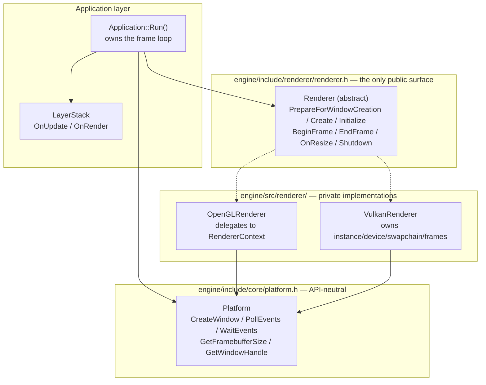
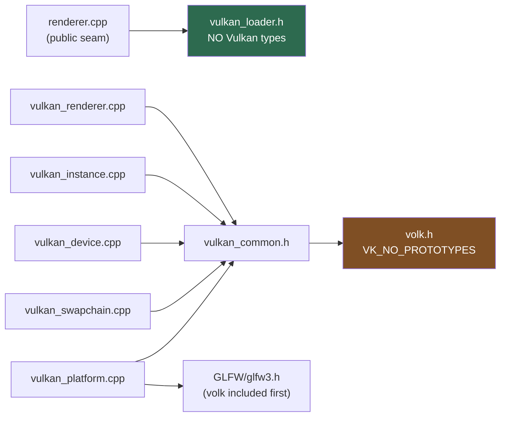
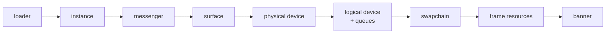
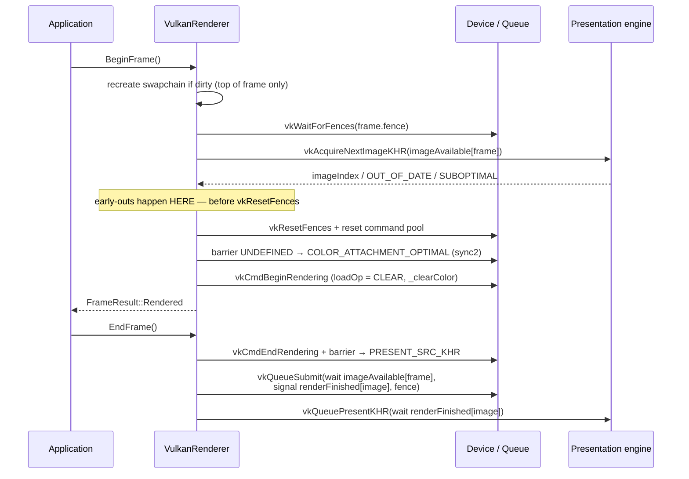
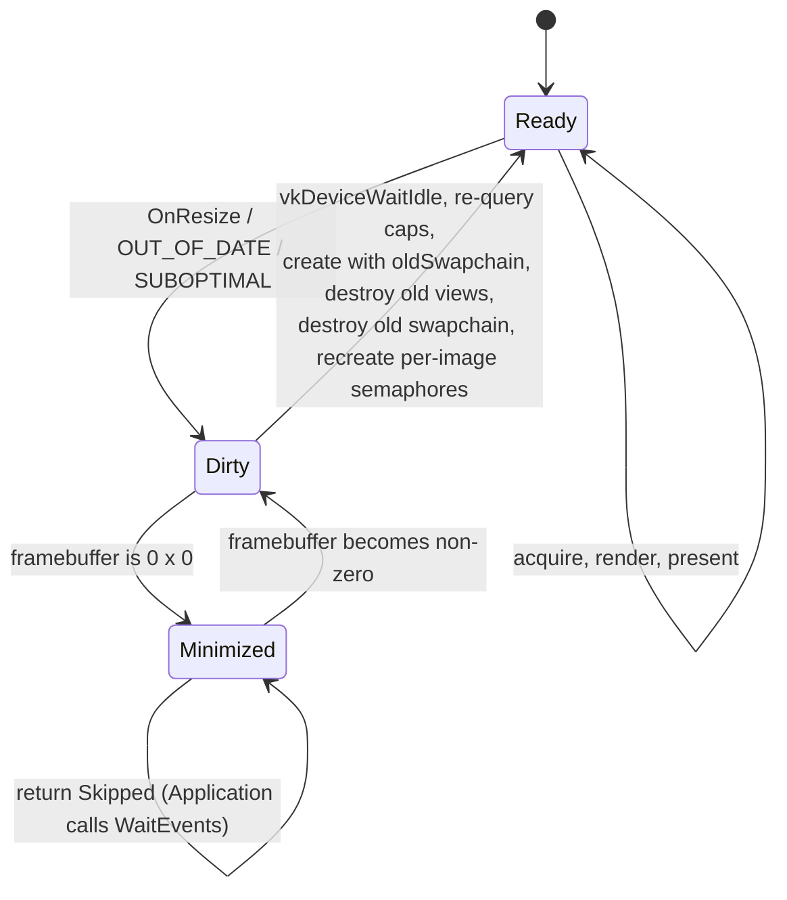

# Vulkyrie Vulkan Renderer — Phase 0 Architecture

## Context

[vulkan-renderer-architecture.md](.claude/plans/vulkan-renderer-architecture.md) is the blueprint for the
whole subsystem — RHI, threading, bindless, frame graph, stats. This document is narrower: it describes the
**architecture that Phase 0 ("Deps & bootstrap") actually puts in the tree**, and — just as importantly —
the shape it leaves behind for Phases 1–5 to grow into.

Phase 0 is as much demolition as construction. The renderer is the least-developed subsystem in the engine:

- `Renderer` ([renderer.h](engine/include/renderer/renderer.h#L38)) is a literally empty class with no subclass.
- Rendering is driven by a free function `Initialize(GraphicsAPI)` plus two namespace-scope globals in
  [renderer.cpp](engine/src/renderer/renderer.cpp) — and **nothing in the frame loop calls the renderer at all**.
  `RendererContext::SwapBuffers()` is dead code; presentation happens inside `VulkyrieGLFWPlatform::OnUpdate()`.
- There is **no renderer shutdown anywhere**. `Scope<RendererContext>` is a namespace-scope global, so
  `~OpenGLRendererContext` issues `glDeleteBuffers` during static destruction — *after* `glfwTerminate()` has
  already destroyed the GL context.
- `Engine` ([core/engine.h](engine/include/core/engine.h)) is uninstantiated dead code; `Application::Run()` is
  the real lifecycle.
- Vulkan exists only as `GraphicsAPI::Vulkan = 2` and a **0-byte** `vulkan_renderer.cpp`.

The target state: a Vulkan-capable window presenting an animated clear colour, validation clean, reached
through a **real `Renderer` subsystem that `Application` owns and drives** — with OpenGL still fully working
for the editor and both existing examples.

---

## Architectural scope

**Established by Phase 0:** the `Renderer` seam and both backends behind it; renderer ownership and shutdown;
the platform layer's API-neutrality; the Vulkan module decomposition and its include topology; the
instance → surface → device → swapchain bring-up chain; the frame-in-flight synchronization model; the
swapchain-recreation state machine; the capability-query and validation policy; the pure-function test seam.

**Deliberately absent (later phases):** VMA and `GpuVram` reporting (P1); the `renderer/rhi/` abstraction —
`IRenderDevice`/`ICommandList`/handle pools (P1); shaders, SPIR-V, pipelines (P2); frame graph on Vulkan (P3);
render thread and parallel recording (P4); stats/HUD (P5). No `IRenderDevice`/`ICommandList` interface, no
handle/generation resource pool, no format translation tables, no `VkRenderPass`/`VkFramebuffer` wrappers
(dynamic rendering makes them unnecessary), no descriptors, no pipeline cache.

`VulkanRenderer` **does not** implement `RendererContext`. That interface's `std::span<f32>`-only buffer API is
a dead end Phase 1 deletes; binding Vulkan to it would have to be undone immediately.

---

## Locked decisions

1. **Introduce the real `Renderer` subsystem now** — abstract base owned by `Application`, with `VulkanRenderer`
   and a thin `OpenGLRenderer` (delegating to the existing `RendererContext`) keeping both backends alive.
   `Engine` stays dead; resurrecting it is a separate, non-Vulkan refactor.
2. **Host app = a new minimal example**, `examples/vulkan_bootstrap/` — not sandbox, not the editor.
3. **Adopt volk now** (`VK_NO_PROTOTYPES`, single include seam) rather than linking the loader and retrofitting
   at Phase 4.
4. **Target Vulkan 1.3 core** — dynamic rendering, synchronization2, timeline semaphores — behind a capability
   query.

---

## Layering



Two properties of this picture are the whole point of Phase 0:

- **`Application` talks to exactly one renderer type**, and it is an abstract one. No `GraphicsAPI` switch
  survives in the frame loop.
- **`Platform` knows about `GraphicsAPI` only at window-creation time.** It creates a window with a GL context
  or with `GLFW_NO_API`, and after that it is a pure event/timing/size service. No GL calls in callbacks, no
  Vulkan types in its header.

---

## 1. The `Renderer` seam

[engine/include/renderer/renderer.h](engine/include/renderer/renderer.h) — the only header downstream targets
see:

```cpp
enum class FrameResult : u8 { Rendered, Skipped, Failed };

class Renderer {
public:
    VE_DELETE_MOVE_AND_COPY(Renderer);
    virtual ~Renderer() = default;

    /** @brief API setup that must happen BEFORE the window exists (Vulkan: volkInitialize +
     *  glfwInitVulkanLoader). Must be called before Platform::CreateWindow(). */
    [[nodiscard]] static StatusCode PrepareForWindowCreation(GraphicsAPI api);

    /** @brief Creates the backend renderer and latches the active graphics API. */
    [[nodiscard]] static Scope<Renderer> Create(GraphicsAPI api);

    [[nodiscard]] virtual StatusCode  Initialize()            = 0;
    virtual void                      Shutdown()              = 0;   // idempotent
    [[nodiscard]] virtual FrameResult BeginFrame()            = 0;
    virtual void                      EndFrame()              = 0;
    virtual void                      OnResize(u32 w, u32 h)  = 0;

    VE_INLINE void SetClearColor(const glm::vec4 &color) { _clearColor = color; }
    [[nodiscard]] VE_INLINE const RendererStatistics &GetStatistics() const { return _statistics; }

protected:
    Renderer() = default;
    glm::vec4          _clearColor{ 0.0F, 0.0F, 0.0F, 1.0F };
    RendererStatistics _statistics{};   // retires today's unreferenced struct
};
```

Three contracts the header itself must document, because they are not inferable from the signatures:

- **`PrepareForWindowCreation` exists because Vulkan's loader must be up before the window is.** `volkInitialize`
  and `glfwInitVulkanLoader` have to run before `glfwCreateWindow`; a single `Initialize()` after window creation
  cannot express that ordering. Under OpenGL it is a no-op.
- **`Shutdown()` is virtual, so each concrete class calls its own `Shutdown()` from its own destructor** — never
  from `~Renderer()`, where the vtable has already been sliced back to the base.
- **`FrameResult::Skipped` is a normal outcome**, not an error: minimized window, swapchain being rebuilt,
  zero-sized framebuffer. Only `Failed` stops the application.

**`GetCurrentGraphicsAPI()` / `GetCurrentGraphicsAPIName()` stay.** Ten factory TUs switch on the former
(`texture_2D.cpp`, `shader.cpp`, `vertex_buffer.cpp`, `graphics_context.cpp`, …) and would silently start
returning `nullptr` if it were removed. The ordering constraint this creates: `Renderer::Create` **sets the
backing global before constructing `OpenGLRenderer`**, because that constructor's `Initialize()` calls
`RendererContext::Create()`, which reads it.

Deleted by Phase 0: the free `Initialize(GraphicsAPI)`, the namespace-scope `_graphicsContext`, and the
never-defined `RendererContext(GraphicsAPI)` declaration.

---

## 2. Ownership and lifetime

`Application` owns the renderer. Member **declaration order is load-bearing**, not cosmetic: a `VkSurfaceKHR`
must be destroyed before the `GLFWwindow*` that created it, and today `_platform` is declared *before*
`_windowProps`, so `Platform::_windowProps` (a reference member) binds to a not-yet-constructed object.

| Order | Member | Constructed | Destroyed | Why |
|---|---|---|---|---|
| 1 | `WindowProps _windowProps` | 1st | last | `Platform` holds a `const WindowProps &` to it |
| 2 | `Ref<Platform> _platform` | 2nd | 2nd | owns the `GLFWwindow*` the surface is derived from |
| 3 | `Scope<Renderer> _renderer` | 3rd | **first** | surface/device must die before the window |

The frame loop:

```cpp
RETURN_ON_FAILURE(Renderer::PrepareForWindowCreation(_windowProps.GraphicsAPI));
RETURN_ON_FAILURE(_platform->CreateWindow());
// ... existing VINFO banner ...
_renderer = Renderer::Create(_windowProps.GraphicsAPI);
if (nullptr == _renderer) return StatusCode::UnsupportedGraphicsAPI;
RETURN_ON_FAILURE(_renderer->Initialize());
// ... OnInit ...
while (_running) {
    _platform->PollEvents();
    _layers.ProcessQueuedOperations();
    for (const auto &layer : _layers) layer->OnUpdate(deltaTime);   // ALWAYS — outside the guard
    const FrameResult result = _renderer->BeginFrame();
    if (FrameResult::Rendered == result) { /* P2+: layer->OnRender() */ _renderer->EndFrame(); }
    else if (FrameResult::Failed == result) { Stop(); }
    else { _platform->WaitEvents(); }   // minimized: don't spin a core at 10k it/s
}
_renderer->Shutdown();
_renderer.reset();
```

**Layer updates sit outside the `BeginFrame` guard by design.** If they were inside it, minimizing the window
would freeze input, physics and timers, and `lastFrameTime` would go stale — so restoring the window would
produce a multi-second delta spike into the simulation.

`Application::OnWindowResized` forwards to `_renderer->OnResize(...)`. [layer.h](engine/include/core/layer.h)
gains `virtual void OnRender() {}` now — one non-breaking line, and exactly the hook Phase 3 needs.

---

## 3. Platform contract

[platform.h](engine/include/core/platform.h) /
[vulkyrie_glfw_platform.cpp](engine/src/core/vulkyrie_glfw_platform.cpp) become API-neutral:

| Change | Rationale |
|---|---|
| `glfwSetErrorCallback` registered **before** `glfwInit()`, and `glfwInit()`'s return checked | Legal per GLFW, and today an init failure is completely silent |
| `GLFW_CONTEXT_VERSION_MAJOR/MINOR 4/6` hints moved **inside** the `GraphicsAPI::OpenGL` branch, with `else { glfwWindowHint(GLFW_CLIENT_API, GLFW_NO_API); }` | A GL context on a Vulkan window is at best wasted, at worst a driver conflict |
| **`glViewport` removed from the framebuffer-size callback** ([vulkyrie_glfw_platform.cpp:383](engine/src/core/vulkyrie_glfw_platform.cpp#L383)) → relocated to `OpenGLRenderer::OnResize` | Under Vulkan glad is never loaded, so that function pointer is NULL and the **first resize crashes**. Driven from `Application::OnWindowResized` it is the same thread and the same GL context as today |
| `OnUpdate()` → `PollEvents()`; add `WaitEvents()` and `GetFramebufferSize(u32 &w, u32 &h)` | `OnUpdate` conflated event pumping with presentation. `WaitEvents` serves the minimized path; `GetFramebufferSize` serves swapchain extent |
| No `Platform::SwapBuffers` | `OpenGLRendererContext::SwapBuffers()` already owns the `GLFWwindow*` |
| `_windowProps` seeded from the **real framebuffer size** after creation | Requested size is in screen coordinates; on HiDPI the framebuffer is larger |
| `SetVSync` stays GL-only; its (currently commented-out) call site moves into `OpenGLRenderer::Initialize()` | `glfwSwapInterval` with no current GL context raises `GLFW_NO_CURRENT_CONTEXT`, which the new error callback would turn into a `VERROR` on every Vulkan launch. For Vulkan, `WindowProps::EnableVSync` maps to **present-mode selection** instead |

---

## 4. Vulkan module decomposition

Everything lives under **`engine/src/renderer/vulkan/`, not `engine/include/`**. Private implementation headers
under `src/` is existing repo precedent (`open_gl_renderer_context.h`), and putting volk in `engine/include/`
would leak Vulkan onto every downstream target's include path and into the engine's public ABI.
`tests/CMakeLists.txt` already adds `engine/src` as a PRIVATE include, so white-box tests work unchanged.

| File | Responsibility |
|---|---|
| `vulkan_common.{h,cpp}` | **The only** place that includes `<volk.h>`. `ToU32`, `EnumerateVulkan`, `VE_VK_CHECK`/`VE_VK_VERIFY`, `VkResult`/device-type/present-mode/format → string, `SetDebugName(...)` |
| `vulkan_loader.h` | Deliberately **Vulkan-type-free** so `renderer.cpp` can include it: `InitializeVulkanLoader()`, `IsVulkanSupported()` |
| `vulkan_platform.{h,cpp}` | The **single TU** including both volk and `<GLFW/glfw3.h>` (volk first). Required instance extensions, `CreateWindowSurface`, framebuffer size. Never includes `vulkyrie_glfw_platform.h` — that would drag in glad |
| `vulkan_context.h` | `struct VulkanContext` — plain aggregate of `VkInstance`/`VkPhysicalDevice`/`VkDevice`/`VkSurfaceKHR`, `QueueFamilyIndices`, queues, `DeviceCapabilities`, `const VkAllocationCallbacks *Allocator`. Passed by `const &`. **This struct is the Phase-1 RHI seam** |
| `vulkan_instance.{h,cpp}` | Instance (API 1.3), layer/extension enumeration, opt-in validation, debug-utils messenger, `volkLoadInstanceOnly` |
| `vulkan_physical_device.{h,cpp}` | Free functions + PODs, not a class. Pure `SelectQueueFamilies` / `ScorePhysicalDevice`; impure `SelectPhysicalDevice` / `QueryDeviceCapabilities` |
| `vulkan_device.{h,cpp}` | Logical device, dedup'd queue families, feature `pNext` chain, `volkLoadDevice` |
| `vulkan_swapchain_support.{h,cpp}` | **Pure selection functions** — the unit-test surface (format, present mode, extent, image count, pre-transform, composite alpha) |
| `vulkan_swapchain.{h,cpp}` | Swapchain, images, views, and the **per-image** `renderFinished` semaphores |
| `vulkan_renderer.{h,cpp}` | `VulkanRenderer : Renderer`. Owns the above; frames-in-flight; the frame loop |
| `README.md` | Subsystem doc mirroring [core/jobs/README.md](engine/include/core/jobs/README.md) |

### Include topology



`vulkan_loader.h` being Vulkan-type-free is what lets the public `renderer.cpp` implement
`PrepareForWindowCreation` without volk entering a TU that also compiles the OpenGL path.

### Deliberate over-engineering (cheap now, expensive later)

Three things Phase 0 builds before it needs them, because retrofitting each one costs an order of magnitude
more:

- **`const VkAllocationCallbacks *Allocator` threaded through every create/destroy call** (as `nullptr` for now).
  Phase 1's memory-tracker hook becomes a one-line change instead of ~60 call sites.
- **`SetDebugName(...)`** — ~15 lines, compiled to a no-op in Release. Every resource added in later phases gets
  named for free, and RenderDoc/validation output stays legible from day one.
- **The command pool is a per-frame struct member**, not a single renderer-wide pool. Phase 4's
  per-frame-per-thread pools then become a nested array rather than a redesign of ownership.

---

## 5. Bring-up and teardown order

**The surface is created before device selection** — this is not negotiable. Present-queue support
(`vkGetPhysicalDeviceSurfaceSupportKHR`) and swapchain adequacy are *inputs* to device selection, so a device
cannot be chosen before a surface exists.



Teardown is the exact reverse, preceded by `vkDeviceWaitIdle`. Both `Initialize` and `Shutdown` are wrapped in
`VE_MEMORY_SCOPE(MemoryTag::Rendering)`.

---

## 6. Frame and synchronization model

`FRAMES_IN_FLIGHT = 2`. The central decision is **which resources are per-frame-in-flight and which are
per-swapchain-image** — a swapchain typically has 3 images against 2 frames in flight, so the two sets are
different sizes and conflating them is a validation error.

| Resource | Owned by | Cardinality | Why |
|---|---|---|---|
| `imageAvailable` semaphore | `VulkanRenderer` | per frame-in-flight | Signalled by acquire, waited by that frame's submit |
| in-flight fence | `VulkanRenderer` | per frame-in-flight | Gates CPU reuse of that frame's command buffer |
| command pool + buffer | `VulkanRenderer` (per-frame struct) | per frame-in-flight | Reset as a unit once its fence signals |
| **`renderFinished` semaphore** | **`VulkanSwapchain`** | **per swapchain image** | See below |

**Why `renderFinished` is per image.** A fence covers the *submit*, not the *present*. With 2 frames in flight
and 3 images, a per-frame `renderFinished` gets re-signalled by a new submit while a still-pending present
holds a reference to it — `VUID-vkQueueSubmit-pSignalSemaphores-00067`. Indexing it by the acquired image
index makes reuse impossible until that image comes back around. It is therefore recreated **with** the
swapchain, and destroying the swapchain is what releases the presentation engine's references to it.

Binary semaphores plus one fence per frame-in-flight is the complete Phase-0 answer. Timeline semaphores are
queried as a capability but cannot be used with acquire/present anyway.



**Fence rules.** Create with `VK_FENCE_CREATE_SIGNALED_BIT` or the very first wait hangs forever. `vkResetFences`
must come **after** the acquire early-outs — resetting and then returning `Skipped` leaves an unsignalled fence
that nothing will ever signal, and the next frame deadlocks.

### Acquire / present result matrix

| Result | Semaphore state | Action |
|---|---|---|
| `VK_ERROR_OUT_OF_DATE_KHR` (acquire) | not signalled, safe to reuse | mark dirty, **don't** reset the fence, return `Skipped` |
| `VK_SUBOPTIMAL_KHR` (acquire) | **signalled** | mark dirty, **render and present this frame normally** — bailing abandons a signalled semaphore |
| `VK_SUCCESS` (acquire) | signalled | proceed |
| `OUT_OF_DATE` / `SUBOPTIMAL` (present) | already consumed | mark dirty |

`VK_SUBOPTIMAL_KHR` is a **positive** (success-class) result, so `VE_VK_CHECK` must not be applied to acquire or
present — only to calls where any non-`VK_SUCCESS` value is a failure. `VkResult` is a *signed* enum, so numeric
fallback formatting casts to `i32`.

---

## 7. Swapchain recreation

Recreation happens at exactly one place: **the top of `BeginFrame`, before any acquire.** Never inside a GLFW
callback (wrong thread-safety story, and the GPU may be mid-frame), never mid-frame. `OnResize` sets a dirty
flag and does nothing else.



The ordering inside the transition matters: destroy the old image views, **then** the old swapchain, **then**
recreate the per-image `renderFinished` semaphores. Destroying the swapchain is what releases the presentation
engine's references to those semaphores — `vkDeviceWaitIdle` does *not* cover the present engine.

**Extent rule.** If `caps.currentExtent.width != 0xFFFFFFFF`, use `currentExtent` verbatim: it is authoritative
and overrides whatever GLFW reports. Only when it is `0xFFFFFFFF` does the framebuffer size get clamped into
`[minImageExtent, maxImageExtent]`.

---

## 8. Capabilities and validation policy

**Capability query.** `QueryDeviceCapabilities` fills a `DeviceCapabilities` POD (`dynamicRendering`,
`synchronization2`, `timelineSemaphore`, …) that both device selection and the startup banner consume. A device
missing `dynamicRendering` scores 0 and is rejected — Phase 0 has no fallback path, and pretending otherwise
would be dead code.

**Feature-query hazard.** The `VkPhysicalDeviceFeatures2` `pNext` chain used to *query* must be a **separate,
persistent** chain from the one handed to `VkDeviceCreateInfo::pNext`. Querying into a local and then passing
the now-dangling chain to device creation is the classic bug in this area.

**Validation layers: warn, never fail.** `/usr/share/vulkan/explicit_layer.d/` is empty on this machine — the
layers live only under the SDK, reachable via `VK_ADD_LAYER_PATH`, which is set in the shell but *not* when the
app is launched from an IDE or a file manager. So the architecture enumerates layers and, if
`VK_LAYER_KHRONOS_validation` is absent, emits a `VWARN` **containing the exact remedy** and continues. A hard
failure here would make the engine unlaunchable from a GUI for no safety benefit.

**`VK_EXT_debug_utils` is an instance extension independent of the validation layer** — enabled in Debug builds
regardless, so `SetDebugName` and command-buffer labels work either way. The messenger create-info is *also*
passed via `VkInstanceCreateInfo::pNext`, so instance creation and destruction are themselves covered. Severity
maps to `VERROR`/`VWARN`/`VINFO`/`VTRACE` with a `[VulkanRenderer]` prefix, mirroring the GL debug callback at
[open_gl_renderer_context.cpp:20-119](engine/src/renderer/open_gl/open_gl_renderer_context.cpp#L20-L119).

---

## 9. Error model

`StatusCode` values become `main` exit codes, so new entries are **appended**, never inserted, to
[status_codes.h](engine/include/core/status_codes.h): `VulkanLoaderNotFound`, `VulkanVersionNotSupported`,
`FailedToCreateVulkanInstance`, `NoSuitableVulkanDevice`, `FailedToCreateVulkanDevice`,
`FailedToCreateVulkanSurface`, `FailedToCreateSwapchain`, `FailedToCreateVulkanSyncObjects`,
`VulkanDeviceLost`.

Three distinct failure channels, deliberately not merged:

| Channel | Type | Meaning |
|---|---|---|
| Bring-up failure | `StatusCode` via `RETURN_ON_FAILURE` | Propagates out of `Run()` to `main`'s exit code |
| Per-frame outcome | `FrameResult` | `Skipped` is normal; only `Failed` calls `Stop()` |
| Vulkan call result | `VkResult` via `VE_VK_CHECK`/`VE_VK_VERIFY` | Programming errors; must not wrap acquire/present |

---

## 10. Build and dependency architecture

- **`volk` only.** Added to [vcpkg.json](vcpkg.json) (port `1.4.341.0`, matching the installed SDK; depends only
  on `vulkan-headers` — no loader), `find_package(volk CONFIG REQUIRED)` in
  [Dependencies.cmake](Dependencies.cmake), linked **PUBLIC** in [engine/CMakeLists.txt](engine/CMakeLists.txt)
  so `tests` inherits the include path.
- **Do not also link `Vulkan::Vulkan`** — one header source, no version skew.
- **Do not define any `VK_USE_PLATFORM_*`.** vcpkg builds `volk::volk` without platform defines, so those entry
  points do not exist in `volk.o`; GLFW creates the surface for us.
- volk arrives via `-isystem` as its own vcpkg target, so the engine's `-Werror` set never touches its headers.
- The engine's `file(GLOB_RECURSE src/*.cpp)` means the new `engine/src/renderer/vulkan/` files compile with no
  source-list maintenance.
- **Host app:** `examples/vulkan_bootstrap/`, CMakeLists copied from sandbox **minus** the `copy_directory`
  POST_BUILD step (there is no assets dir, so the command would fail) and minus `imgui::imgui`. Registered in the
  `VULKYRIE_BUILD_EXAMPLES` block of the root [CMakeLists.txt](CMakeLists.txt); no preset changes needed.

`Application` has no per-frame virtual hook, so the example pushes exactly **one** trivial layer whose
`OnUpdate(Timestep)` accumulates time and calls `GetRenderer()->SetClearColor(...)`. That proves the layer stack
works under Vulkan and gives `SetClearColor` on the base class a real reason to exist — the GL backend implements
it as `glClearColor`/`glClear`, which keeps both backends honest against the same seam.

---

## 11. Testability

The selection logic is **pure free functions over plain structs**, specifically so it can be tested without a
`VkInstance`, a device, or a display. This is the main reason `vulkan_physical_device` and
`vulkan_swapchain_support` are function-and-POD modules rather than classes. Tests live in
`tests/src/renderer/vulkan/`, mirroring the engine layout; repo style is full-sentence `TEST_CASE` names and
lowercase tags.

| Test file | Tags | Covers |
|---|---|---|
| `vulkan_swapchain_selection_tests.cpp` | `[renderer][vulkan][swapchain]` | preferred `B8G8R8A8_SRGB`/`SRGB_NONLINEAR` when present; first-format fallback; FIFO when VSync is requested even if MAILBOX exists; MAILBOX when VSync is off; IMMEDIATE→FIFO fallback; `currentExtent` verbatim when concrete; framebuffer clamped when `0xFFFFFFFF`; `minImageCount + 1` respecting a non-zero `maxImageCount` |
| `vulkan_device_selection_tests.cpp` | `[renderer][vulkan][device]` | combined graphics+present family preferred; separate-family fallback; dedicated transfer family picked; discrete scored above integrated; device missing `dynamicRendering` scores 0 |
| `vulkan_instance_smoke_tests.cpp` | `[.][vulkan-device]` (Catch2 hidden) | creates a real instance and picks a device when an ICD is present — hidden so `ctest` stays hermetic on headless machines |

---

## 12. House rules imposed by the toolchain

The engine compiles with `-Wall -Wextra -Wconversion -Wsign-conversion -Wpedantic -Werror`, and Vulkan's API
shape collides with that in three predictable ways. These are architecture, not style preferences — they decide
what the code in every Vulkan TU looks like.

- **Sparse designated initializers are a build error** under `-Wextra`
  (`-Wmissing-designated-field-initializers` / `-Wmissing-field-initializers`), verified on both clang 22 and
  g++ on this machine — and every `VkXxxCreateInfo` would trip it. **House style is `VkXxx info{};` followed by
  member assignment.** The engine's warning set is not weakened to work around this.
- **Two helpers in `vulkan_common.h` absorb most of the remaining friction:**
  `template <typename T> [[nodiscard]] VE_INLINE u32 ToU32(T value)` narrows with a Debug-only `VASSERT`
  (killing `-Wshorten-64-to-32` from `vector::size()` and `-Wsign-conversion` from GLFW's `i32` sizes), and
  `template <typename T, typename TFn> [[nodiscard]] std::vector<T> EnumerateVulkan(TFn &&query)` wraps the
  Vulkan two-call count/resize/fill idiom, removing ~8 hand-rolled conversion sites.
- **Clear-colour literals are `0.0F`** (`-Wimplicit-float-conversion`), and `.clang-tidy` naming applies:
  `ConstexprVariableCase: UPPER_CASE` (so `FRAMES_IN_FLIGHT`), `PrivateMethodCase: camelBack`,
  `PrivateMemberCase: camelBack` with a `_` prefix.

---

## Design invariants

The short list that must hold for the subsystem to be correct — each one is a bug that is expensive to find
later:

1. `PrepareForWindowCreation` runs **before** `Platform::CreateWindow()`.
2. `Renderer::Create` latches the `GraphicsAPI` global **before** constructing a backend.
3. `_renderer` is declared last in `Application` and therefore destroyed first.
4. Each concrete renderer calls its **own** `Shutdown()` from its **own** destructor; `Shutdown()` is idempotent.
5. The surface exists **before** physical-device selection.
6. Teardown is bring-up reversed, preceded by `vkDeviceWaitIdle`.
7. `renderFinished` is **per swapchain image**; `imageAvailable`, the fence, and the command pool are **per
   frame-in-flight**.
8. Fences are created signalled; `vkResetFences` happens **after** the acquire early-outs.
9. `VK_SUBOPTIMAL_KHR` on acquire **renders and presents anyway**; only `OUT_OF_DATE` returns `Skipped`.
10. Swapchain recreation happens only at the top of `BeginFrame`; `OnResize` sets a flag and returns.
11. A concrete `currentExtent` overrides GLFW's framebuffer size.
12. The feature-query `pNext` chain is a different, persistent object from the device-create `pNext` chain.
13. `<volk.h>` is included from `vulkan_common.h` and nowhere else; volk is included before GLFW in the one TU
    that needs both.
14. Layer `OnUpdate` runs every iteration, regardless of `FrameResult`.

---

## Extension points for later phases

Phase 0's decomposition is chosen so each later phase is an addition, not a rewrite:

| Seam left by Phase 0 | Consumed by |
|---|---|
| `VulkanContext` aggregate passed by `const &` | **P1** — becomes the backing state of `IRenderDevice` |
| `const VkAllocationCallbacks *Allocator` threaded everywhere | **P1** — memory-tracker hook, `GpuVram` bucket, one-line change |
| Per-frame command pool as a struct member | **P4** — nested per-frame × per-thread array |
| `Layer::OnRender()` | **P3** — frame-graph pass recording |
| `RendererStatistics` on the `Renderer` base | **P5** — grows into the stats subsystem + ImGui HUD |
| `SetDebugName(...)` | **P1+** — every new resource named as it is created |
| `DeviceCapabilities` POD + scoring | **P6** — bindless / mesh-shader / ray-tracing gating |
| Pure selection functions | all phases — the pattern for testable, device-free logic |

---

## Verification architecture

- **Build gates:** `/build clang-all-debug`, then `gcc-all-debug` and `clang-all-release`. Warnings are errors,
  so a clean build across two compilers and both configs is a real gate, not a formality.
- **Unit:** `/test clang-all-debug "[vulkan]"` for selection logic; the full suite for regressions (notably the
  existing `[framegraph]` suite).
- **Vulkan end-to-end:** `build/clang-all-debug/examples/vulkan_bootstrap/vulkan_bootstrap` — animated clear
  colour, continuous drag-resize, minimize→restore, alt-tab, clean close, **zero validation errors**. Then a
  second run with **synchronization validation** enabled (vkconfig, or
  `VK_LAYER_ENABLES=VALIDATION_CHECK_ENABLE_SYNCHRONIZATION_VALIDATION`) — this is specifically what proves the
  per-image `renderFinished` decision.
- **Validation-absent path:** re-run with `VK_ADD_LAYER_PATH` unset to prove warn-and-continue.
- **OpenGL regression (equally important):** `examples/sandbox`, `examples/asteroids`, and `editor` all still
  render, resize correctly, and now shut down **without post-`main` GL calls** — the static-destruction bug
  proven fixed.
- **Tooling:** a RenderDoc capture shows the named device/queue/swapchain objects from `SetDebugName`.
- **Style:** `/format-check` clean.

---

## See also

- [vulkan-renderer-architecture.md](.claude/plans/vulkan-renderer-architecture.md) — the full-subsystem blueprint
  and Phase 1–8 roadmap this document is the first slice of.
- [vulkan-renderer-phase-0-implementation-plan.md](.claude/plans/vulkan-renderer-phase-0-implementation-plan.md)
  — the ordered, bisectable execution plan (steps, checkpoints) for building what is described here.
- [core/jobs/README.md](engine/include/core/jobs/README.md) — the model this subsystem's own README should follow.
- [memory-subsystem-architecture.md](.claude/plans/memory-subsystem-architecture.md) — `VE_MEMORY_SCOPE` and the
  `GpuVram` bucket Phase 1 reports into.
