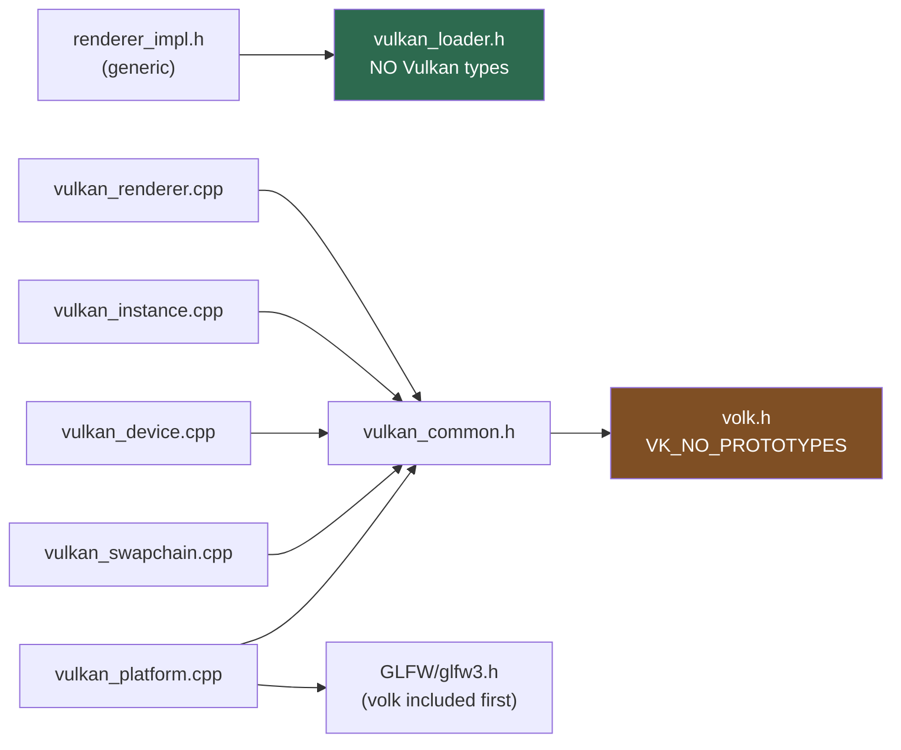
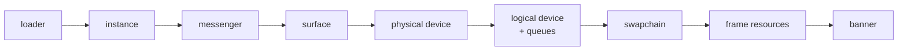
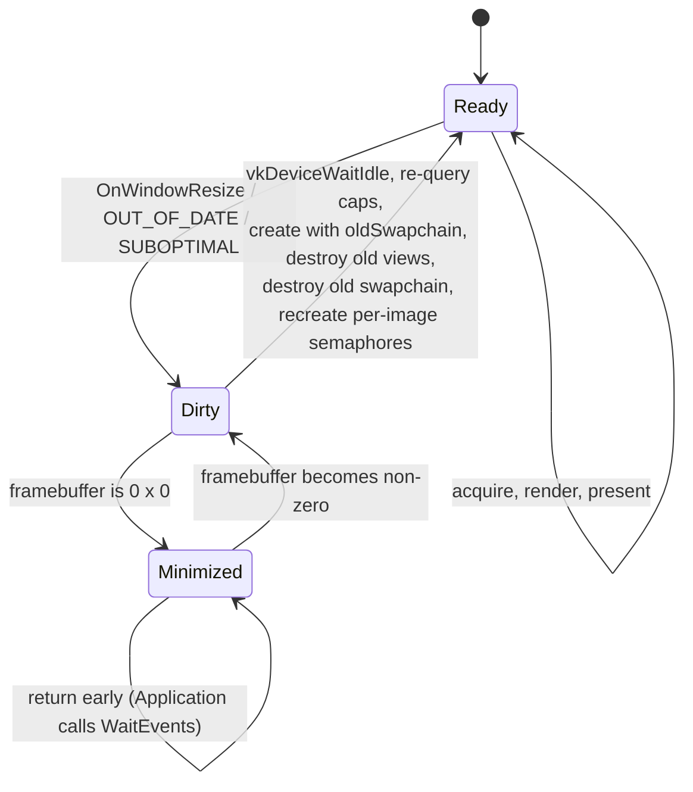

# Vulkan Renderer — Phase 0: Bring-Up

## Context

[vulkan-renderer-architecture.md](vulkan-renderer-architecture.md) is the blueprint for the whole
subsystem — RHI, threading, bindless, frame graph, stats. This document is the first slice: **what it
takes to get a Vulkan-capable window presenting an animated clear colour, validation clean, driven
through `RendererImpl<VulkanBackend>::Render()`** — and the shape that leaves behind for Phases 1–8.

The RHI scaffolding already exists. `Renderer` is a real abstract seam, `RendererBackend` is a real
concept, `Device<B>` and `RendererImpl<B>` are real templates, and both backend trait structs satisfy
the concept. What does not exist is any Vulkan: no `volk`, no `vulkan` package in `vcpkg.json`, no
instance, device or swapchain code, and every `Context::Create*` is a declaration without a definition.

So Phase 0 is **construction on existing scaffolding**, not the demolition an earlier draft of this plan
described. The old renderer globals, `RendererContext`, and `core/engine.h` are already gone — moved to
`backup/` or deleted outright.

The target: a Vulkan window presenting an animated clear colour, validation clean, reached through the
existing `Renderer` seam.

---

## Locked decisions

1. **Build on `RendererImpl<VulkanBackend>`.** No hand-written `VulkanRenderer : Renderer` class. Vulkan
   state lives in `VulkanContext` (instance, device, queues) and `VulkanSwapchain` (swapchain, images,
   per-image semaphores); `RendererImpl<B>` drives them generically.
2. **Host app = a new minimal example**, `examples/vulkan_bootstrap/` — not sandbox, not the editor.
   Neither of those has a working render path today, and coupling bring-up to restoring them would
   entangle two independent problems.
3. **Adopt volk now** (`VK_NO_PROTOTYPES`, single include seam) rather than linking the loader and
   retrofitting later.
4. **Target Vulkan 1.3 core** — dynamic rendering, synchronization2, timeline semaphores — behind a
   capability query.

---

## The concept gap Phase 0 must close first

This is the one piece of design work that has no counterpart in the pre-pivot plan, and it blocks
everything else.

`RendererBackend` names `Swapchain` and `CommandPool` as required types but **requires no operations on
either** — `RendererBackendTypes` only asserts the names exist. `RendererImpl<B>` therefore has no
concept-sanctioned way to acquire an image, present, or record. Meanwhile `Device<B>` already calls
`Context::GetGraphicsQueue()`, `GetTransferQueue()`, `GetComputeQueue()` and `GetHeap()`, none of which
the concept requires and neither context declares — it compiles only because those template members are
never instantiated.

Phase 0 extends the concept to match what a frame actually needs:

- **`Context`:** the queue accessors `Device<B>` already calls, plus `GetHeap()` guarded by
  `requires(B::kUsesBindlessHeap)`.
- **`Swapchain`:** acquire, present, resize-notify and recreate, plus the current extent and format.
- **`CommandPool`:** reset, and allocation of a `B::CommandList`.
- **Fix `CreatePipeline(Pipeline) -> bool`**, which sits in the destroy group and is plainly meant to be
  `DestroyPipeline` — pipelines currently have no destroy path at all.

Every addition must be satisfiable by `OpenGLBackend` too, or guarded by a capability constant. That
constraint is the point: the concept is the contract, and a Vulkan-only requirement that silently skips
it is how the abstraction rots.

**Signalling skipped and failed frames.** `Renderer::Render()` returns `void`, so the old design's
`FrameResult::{Rendered,Skipped,Failed}` has nowhere to go. Phase 0 handles skips internally — a
minimized window or an out-of-date swapchain returns early from `Render()` without drawing — and
surfaces hard failure through the existing `DeviceLost()`, which `Application` polls. If skip/fail needs
to reach the caller later, that is a seam change, made deliberately.

---

## Vulkan module decomposition

Everything under **`engine/src/renderer/backends/vulkan/`**, alongside the existing stubs. Private
implementation headers under `src/` is repo precedent, and putting volk in `engine/include/` would leak
Vulkan onto every downstream target's include path and into the engine's public ABI.
`tests/CMakeLists.txt` already adds `engine/src` as a PRIVATE include, so white-box tests work unchanged.

| File | Responsibility |
|---|---|
| `vulkan_common.{h,cpp}` | **The only** place that includes `<volk.h>`. `ToU32`, `EnumerateVulkan`, `VE_VK_CHECK`/`VE_VK_VERIFY`, `VkResult`/device-type/present-mode/format → string, `SetDebugName(...)` |
| `vulkan_loader.h` | Deliberately **Vulkan-type-free** so neutral TUs can include it: `InitializeVulkanLoader()`, `IsVulkanSupported()` |
| `vulkan_platform.{h,cpp}` | The **single TU** including both volk and `<GLFW/glfw3.h>` (volk first). Required instance extensions, `CreateWindowSurface`, framebuffer size. Never includes `vulkyrie_glfw_platform.h` — that would drag in glad |
| `vulkan_instance.{h,cpp}` | Instance (API 1.3), layer/extension enumeration, opt-in validation, debug-utils messenger, `volkLoadInstanceOnly` |
| `vulkan_physical_device.{h,cpp}` | Free functions and PODs, not a class. Pure `SelectQueueFamilies` / `ScorePhysicalDevice`; impure `SelectPhysicalDevice` / `QueryDeviceCapabilities` |
| `vulkan_device.{h,cpp}` | Logical device, dedup'd queue families, feature `pNext` chain, `volkLoadDevice` |
| `vulkan_swapchain_support.{h,cpp}` | **Pure selection functions** — the unit-test surface (format, present mode, extent, image count, pre-transform, composite alpha) |
| `vulkan_context.{h,cpp}` | **Exists as a stub.** Grows to own instance/physical device/device/surface/queues and implement the `Create*`/`Destroy*` surface |
| `vulkan_swapchain.{h,cpp}` | **Exists as an empty class.** Grows to own the swapchain, images, views, and the **per-image** `renderFinished` semaphores |
| `vulkan_pool.h` / `vulkan_command_list.h` | **Exist as stubs.** Grow into the per-frame command pool and its recorded buffer |
| `README.md` | Subsystem doc following [core/jobs/README.md](engine/include/core/jobs/README.md) |

### Include topology



`vulkan_loader.h` being Vulkan-type-free is what lets neutral code initialize the loader without volk
entering a TU that also compiles the OpenGL path.

### Deliberate over-engineering

Three things to build before they are needed, because retrofitting each costs an order of magnitude more:

- **`const VkAllocationCallbacks *Allocator` threaded through every create/destroy call** (as `nullptr`
  for now). Phase 1's memory-tracker hook becomes a one-line change instead of ~60 call sites.
- **`SetDebugName(...)`** — ~15 lines, a no-op in Release. Every resource added later is named for free,
  and RenderDoc/validation output stays legible from day one.
- **The command pool is a per-frame struct member**, not one renderer-wide pool. Phase 4's
  per-frame-per-thread pools become a nested array rather than a redesign of ownership.

---

## Bring-up and teardown order

**The surface is created before device selection** — not negotiable. Present-queue support
(`vkGetPhysicalDeviceSurfaceSupportKHR`) and swapchain adequacy are *inputs* to device selection, so a
device cannot be chosen before a surface exists.



Teardown is the exact reverse, preceded by `vkDeviceWaitIdle`. Both paths are wrapped in
`VE_MEMORY_SCOPE(MemoryTag::Rendering)`.

**The loader must be initialized before the window exists.** `volkInitialize` and
`glfwInitVulkanLoader` have to run before `glfwCreateWindow`. Since the current seam has no
`PrepareForWindowCreation` hook, `Application::Run()` calls `InitializeVulkanLoader()` from
`vulkan_loader.h` directly, ahead of window creation, guarded on the configured `GraphicsAPI`. Under
OpenGL it is a no-op.

---

## Frame and synchronization model

`VulkanBackend::kFramesInFlight` is already `2`. The central decision is **which resources are
per-frame-in-flight and which are per-swapchain-image** — a swapchain typically has 3 images against 2
frames in flight, so the two sets are different sizes and conflating them is a validation error.

| Resource | Owned by | Cardinality | Why |
|---|---|---|---|
| `imageAvailable` semaphore | `VulkanContext` frame state | per frame-in-flight | Signalled by acquire, waited by that frame's submit |
| in-flight fence | `VulkanContext` frame state | per frame-in-flight | Gates CPU reuse of that frame's command buffer |
| command pool + buffer | `VulkanPool` (per-frame) | per frame-in-flight | Reset as a unit once its fence signals |
| **`renderFinished` semaphore** | **`VulkanSwapchain`** | **per swapchain image** | See below |

**Why `renderFinished` is per image.** A fence covers the *submit*, not the *present*. With 2 frames in
flight and 3 images, a per-frame `renderFinished` gets re-signalled by a new submit while a still-pending
present holds a reference to it — `VUID-vkQueueSubmit-pSignalSemaphores-00067`. Indexing it by the
acquired image index makes reuse impossible until that image comes back around. It is therefore
recreated **with** the swapchain, and destroying the swapchain is what releases the presentation
engine's references to it.

Binary semaphores plus one fence per frame-in-flight is the complete Phase 0 answer. Timeline semaphores
are queried as a capability (`VulkanBackend::kHasTimelineSync` is `true`) but cannot be used with
acquire/present anyway.

```mermaid
sequenceDiagram
    participant App as Application
    participant R as RendererImpl&lt;VulkanBackend&gt;
    participant SC as VulkanSwapchain
    participant GPU as Device / Queue
    participant P as Presentation engine

    App->>R: Render()
    R->>SC: recreate if dirty (top of frame only)
    R->>GPU: vkWaitForFences(frame.fence)
    R->>P: vkAcquireNextImageKHR(imageAvailable[frame])
    P-->>R: imageIndex / OUT_OF_DATE / SUBOPTIMAL
    Note over R: early-outs happen HERE — before vkResetFences
    R->>GPU: vkResetFences + reset command pool
    R->>GPU: barrier UNDEFINED → COLOR_ATTACHMENT_OPTIMAL (sync2)
    R->>GPU: vkCmdBeginRendering (loadOp = CLEAR)
    R->>GPU: vkCmdEndRendering + barrier → PRESENT_SRC_KHR
    R->>GPU: vkQueueSubmit(wait imageAvailable[frame],<br/>signal renderFinished[image], fence)
    R->>P: vkQueuePresentKHR(wait renderFinished[image])
```

**Fence rules.** Create with `VK_FENCE_CREATE_SIGNALED_BIT` or the very first wait hangs forever.
`vkResetFences` must come **after** the acquire early-outs — resetting and then returning early leaves an
unsignalled fence nothing will ever signal, and the next frame deadlocks.

### Acquire / present result matrix

| Result | Semaphore state | Action |
|---|---|---|
| `VK_ERROR_OUT_OF_DATE_KHR` (acquire) | not signalled, safe to reuse | mark dirty, **don't** reset the fence, return early |
| `VK_SUBOPTIMAL_KHR` (acquire) | **signalled** | mark dirty, **render and present this frame normally** — bailing abandons a signalled semaphore |
| `VK_SUCCESS` (acquire) | signalled | proceed |
| `OUT_OF_DATE` / `SUBOPTIMAL` (present) | already consumed | mark dirty |

`VK_SUBOPTIMAL_KHR` is a **positive** (success-class) result, so `VE_VK_CHECK` must not wrap acquire or
present — only calls where any non-`VK_SUCCESS` value is a failure. `VkResult` is a *signed* enum, so
numeric fallback formatting casts to `i32`.

---

## Swapchain recreation

Recreation happens at exactly one place: **the top of `Render()`, before any acquire.** Never inside a
GLFW callback (wrong thread-safety story, and the GPU may be mid-frame), never mid-frame.
`OnWindowResize` sets a dirty flag and does nothing else.



The ordering inside the transition matters: destroy the old image views, **then** the old swapchain,
**then** recreate the per-image `renderFinished` semaphores. Destroying the swapchain is what releases
the presentation engine's references to those semaphores — `vkDeviceWaitIdle` does *not* cover the
present engine.

**Extent rule.** If `caps.currentExtent.width != 0xFFFFFFFF`, use `currentExtent` verbatim: it is
authoritative and overrides whatever GLFW reports. Only when it is `0xFFFFFFFF` does the framebuffer size
get clamped into `[minImageExtent, maxImageExtent]`.

---

## Capabilities and validation policy

**Capability query.** `QueryDeviceCapabilities` fills the existing `DeviceCapabilities` POD from
`rhi_types.h` — which already carries VRAM budget, bindless limits, subgroup size, and mesh-shader /
ray-tracing / async-compute flags — and both device selection and the startup banner consume it. A device
missing `dynamicRendering` scores 0 and is rejected; Phase 0 has no fallback path, and pretending
otherwise would be dead code.

**Feature-query hazard.** The `VkPhysicalDeviceFeatures2` `pNext` chain used to *query* must be a
**separate, persistent** chain from the one handed to `VkDeviceCreateInfo::pNext`. Querying into a local
and then passing the now-dangling chain to device creation is the classic bug in this area.

**Validation layers: warn, never fail.** `/usr/share/vulkan/explicit_layer.d/` is empty on this machine —
the layers live only under the SDK, reachable via `VK_ADD_LAYER_PATH`, which is set in the shell but
*not* when the app is launched from an IDE or a file manager. So enumerate layers and, if
`VK_LAYER_KHRONOS_validation` is absent, emit a `VWARN` **containing the exact remedy** and continue. A
hard failure would make the engine unlaunchable from a GUI for no safety benefit.

**`VK_EXT_debug_utils` is an instance extension independent of the validation layer** — enable it in
Debug builds regardless, so `SetDebugName` and command-buffer labels work either way. Pass the messenger
create-info *also* via `VkInstanceCreateInfo::pNext`, so instance creation and destruction are themselves
covered. Map severity to `VERROR`/`VWARN`/`VINFO`/`VTRACE` with a `[Vulkan]` prefix.

---

## Error model

`StatusCode` values become `main` exit codes, so new entries are **appended**, never inserted, to
[status_codes.h](engine/include/core/status_codes.h): `VulkanLoaderNotFound`,
`VulkanVersionNotSupported`, `FailedToCreateVulkanInstance`, `NoSuitableVulkanDevice`,
`FailedToCreateVulkanDevice`, `FailedToCreateVulkanSurface`, `FailedToCreateSwapchain`,
`FailedToCreateVulkanSyncObjects`, `VulkanDeviceLost`.

Three failure channels, deliberately not merged:

| Channel | Type | Meaning |
|---|---|---|
| Bring-up failure | `StatusCode` via `RETURN_ON_FAILURE` | Propagates out of `Run()` to `main`'s exit code |
| Per-frame skip | early return from `Render()` | Normal: minimized, swapchain rebuilding, zero-sized framebuffer |
| Device loss | `Renderer::DeviceLost()` | Polled by `Application`; the only frame-level condition that stops the app |
| Vulkan call result | `VkResult` via `VE_VK_CHECK`/`VE_VK_VERIFY` | Programming errors; must not wrap acquire/present |

---

## Platform hardening

All three defects below are still present and unfixed.

- Register `glfwSetErrorCallback` **before** `glfwInit()` (legal, and today an init failure is silent),
  then check `glfwInit()`'s return value.
- Move the `GLFW_CONTEXT_VERSION_MAJOR/MINOR` hints **inside** the `GraphicsAPI::OpenGL` branch
  ([vulkyrie_glfw_platform.cpp:346](engine/src/core/vulkyrie_glfw_platform.cpp#L346)); add
  `else { glfwWindowHint(GLFW_CLIENT_API, GLFW_NO_API); }`.
- **Remove the `glViewport` call from the framebuffer-size callback**
  ([vulkyrie_glfw_platform.cpp:383](engine/src/core/vulkyrie_glfw_platform.cpp#L383)). Under Vulkan
  glad is never loaded, so that pointer is null and the first resize is undefined behaviour. It relocates
  into the OpenGL backend's resize path.
- Add `WaitEvents()` (`glfwWaitEvents`, for the minimized path) and `GetFramebufferSize(u32 &w, u32 &h)`.
- Seed the window props from the real framebuffer size after creation (HiDPI: the requested size is in
  screen coordinates).
- `SetVSync` stays GL-only. Calling `glfwSwapInterval` with no GL context raises
  `GLFW_NO_CURRENT_CONTEXT`, which the error callback would turn into a `VERROR` on every Vulkan launch.
  For Vulkan, vsync maps to present-mode selection instead.

---

## Application rewiring

Two defects and two gaps.

**Destruction order is currently inverted, and the fix is a deletion.** The member declaration order is
already correct:

```cpp
ApplicationSettings mAppSettings;   // constructed 1st, destroyed last
Scope<Platform>     mPlatform;      // constructed 2nd
Scope<Renderer>     mRenderer;      // constructed 3rd, destroyed FIRST
```

Reverse-declaration destruction would therefore release `mRenderer` before `mPlatform` — exactly right,
since a `VkSurfaceKHR` must not outlive its window. But `~Application()`'s body runs *before* member
destructors and explicitly calls `mPlatform.reset()`, destroying the GLFW window first. **Delete that
line** and let declaration order do the work; the destructor can then be `= default`.

**`DeviceCreationInfo` is default-constructed.** `Renderer::Create(api, {})` passes no native window
handle and no size — `NativeWindow` is `nullptr`. Populate it from the real window after creation.
`DeviceCreationInfo` already carries the window handle, display, width, height, resource-budget caps, and
validation/GPU-preference/vsync flags, so no new type is needed.

**`Render()` is never called.** `Run()`'s loop processes queued layer operations, updates layers, and
calls `mPlatform->OnUpdate()` — there is no render step. `OnWindowResize()` *is* already wired from
`OnWindowResized` (`application.cpp:124`), but unconditionally, while `mRenderer` is not assigned until
`Run()` line 46 — after `CreateWindow()`. **A resize event during window creation dereferences a null
`mRenderer`**; guard it. The loop becomes:

```cpp
while (mRunning) {
    mPlatform->PollEvents();
    mLayers.ProcessQueuedOperations();
    for (const auto &layer : mLayers) layer->OnUpdate(deltaTime);   // ALWAYS — see below
    if (mRenderer->DeviceLost()) { Stop(); break; }
    mRenderer->Render();
    if (mMinimized) mPlatform->WaitEvents();   // don't spin a core at 10k it/s
}
```

Layer updates must stay **outside** any render guard — otherwise minimizing freezes input, physics and
timers, and the frame delta goes stale so restoring produces a spike. The existing delta clamp
(`std::min(time - lastFrameTime, 0.1F)`) already covers the spike, but only if updates keep running. Add
`virtual void OnRender() {}` to `layer.h` now — one non-breaking line, and exactly the hook Phase 3 needs.

---

## Build and dependencies

Add to `vcpkg.json`: `volk`, plus `vulkan-headers`. `vulkan-memory-allocator`, `shaderc` and
`spirv-cross` are Phase 1–2 and stay out for now. Wire `find_package` in `Dependencies.cmake` and link
volk PRIVATE to `engine`. `VK_NO_PROTOTYPES` is defined for the engine target only.

The vcpkg re-resolve is slow and one-time; do it as its own step so a long dependency fetch never
interleaves with a compile error.

---

## Testability

The concept requires method-call syntax, so `VulkanContext` is a class rather than a plain aggregate
operated on by free functions. That does not cost testability, but it does move it: **`VulkanContext`'s
methods delegate to pure free functions**, and those functions are the unit-test surface.

- `vulkan_physical_device.{h,cpp}` — `SelectQueueFamilies`, `ScorePhysicalDevice` as pure functions over
  PODs, testable without a `VkInstance`.
- `vulkan_swapchain_support.{h,cpp}` — format, present-mode, extent, image-count, pre-transform and
  composite-alpha selection, all pure.

Tests land in `tests/src/renderer/vulkan/`, tagged `[vulkan]`. Note that **no tests currently cover the
backend architecture at all** — `tests/src/renderer/` contains only the frame graph suite — so this is
also the first coverage of anything under `renderer/backends/`.

---

## Implementation sequence

Steps 1–3 contain **zero Vulkan code**, deliberately, so the concept work and the new API never fail at
the same time. Each step ends green and is independently bisectable.

| # | Work | Checkpoint |
|---|---|---|
| 0 | Baseline | `/build clang-all-debug` green; know what "working" looks like. Note that green currently means "links", not "draws". |
| 1 | Concept extension: `Swapchain`/`CommandPool` ops, `Context` queue accessors, `DestroyPipeline` fix. Both trait structs updated to satisfy it | Both `static_assert(RendererBackend<…>)` still pass; build green under `-Werror` on clang **and** gcc. |
| 2 | `vcpkg.json` + `Dependencies.cmake` + engine link | vcpkg re-resolves (slow, one-time); `volk.h` present in `vcpkg_installed`; build still green. |
| 3 | Platform hardening + `Application` fixes (destruction order, populate `DeviceCreationInfo`, wire `Render()`/`OnWindowResize()` into the loop, `Layer::OnRender()`) | All targets build and run exactly as step 0; no post-`main` GL calls. |
| 4 | `vulkan_common.{h,cpp}` **only** — include seam, `ToU32`, `EnumerateVulkan`, string helpers, `VE_VK_CHECK`, `SetDebugName` | Builds under `-Werror` on both compilers. Don't skip: this proves the include seam at near-zero risk. |
| 5 | Loader bootstrap + instance + messenger + the `vulkan_bootstrap` example (`Render()` returns immediately) | Blank window; logs instance version, extensions, validation status; exits clean. Re-run with `VK_ADD_LAYER_PATH` unset to prove warn-and-continue. |
| 6 | Surface + physical device + logical device + capabilities | Banner logs device name, API version, driver, queue families, and `dynamicRendering`/`synchronization2`/`timelineSemaphore`. |
| 7 | Swapchain + pure selection functions + unit tests | `/test clang-all-debug "[vulkan]"` passes; flipping vsync in the example changes the logged present mode. |
| 8 | Frame loop — pools, sync objects, sync2 barriers, `vkCmdBeginRendering` clear, submit, present, recreation | Animated clear colour; drag-resize; minimize/restore; alt-tab; close. Validation silent. |
| 9 | README, `/format-check`, cross-compiler and release builds | Everything below. |

---

## Design invariants

Each of these is a bug that is expensive to find later.

1. The Vulkan loader is initialized **before** the window is created.
2. The surface exists **before** physical-device selection.
3. `mRenderer` is declared last in `Application` and therefore destroyed first; `~Application()` does not
   explicitly reset `mPlatform`.
4. Teardown is bring-up reversed, preceded by `vkDeviceWaitIdle`.
5. `renderFinished` is **per swapchain image**; `imageAvailable`, the fence and the command pool are
   **per frame-in-flight**.
6. Fences are created signalled; `vkResetFences` happens **after** the acquire early-outs.
7. `VK_SUBOPTIMAL_KHR` on acquire **renders and presents anyway**; only `OUT_OF_DATE` returns early.
8. Swapchain recreation happens only at the top of `Render()`; `OnWindowResize` sets a flag and returns.
9. A concrete `currentExtent` overrides GLFW's framebuffer size.
10. The feature-query `pNext` chain is a different, persistent object from the device-create chain.
11. `<volk.h>` is included from `vulkan_common.h` and nowhere else; volk precedes GLFW in the one TU
    needing both.
12. Layer `OnUpdate` runs every iteration, regardless of whether a frame was drawn.
13. Anything added to the concept is satisfiable by `OpenGLBackend`, or guarded by a capability constant.

---

## Seams left for later phases

| Seam left by Phase 0 | Consumed by |
|---|---|
| `VulkanContext` owning instance/device/queues | **P1** — the backing state for real resource creation |
| `const VkAllocationCallbacks *Allocator` threaded everywhere | **P1** — memory-tracker hook and `GpuVram` bucket, one-line change |
| Per-frame command pool as a struct member | **P4** — nested per-frame × per-thread array |
| `Layer::OnRender()` | **P3** — frame-graph pass recording |
| `RendererStatistics`, already on the seam | **P5** — stats subsystem and ImGui HUD |
| `SetDebugName(...)` | **P1+** — every new resource named as it is created |
| `DeviceCapabilities` POD + scoring | **P6** — bindless / mesh-shader / ray-tracing gating |
| Pure selection functions | all phases — the pattern for testable, device-free logic |

---

## Verification

- **Build:** `/build clang-all-debug`, then `gcc-all-debug` and `clang-all-release`. Warnings are errors,
  so a clean build across two compilers and both configs is a real gate — but see the caveat below.
- **Tests:** `/test clang-all-debug "[vulkan]"` for selection logic; the full suite for regressions
  (notably the existing `[framegraph]` suite).
- **Vulkan end-to-end:** `build/clang-all-debug/examples/vulkan_bootstrap/vulkan_bootstrap` — animated
  clear colour, continuous drag-resize, minimize→restore, alt-tab, clean close, **zero validation
  errors**. Then a second run with **synchronization validation** enabled (vkconfig, or
  `VK_LAYER_ENABLES=VALIDATION_CHECK_ENABLE_SYNCHRONIZATION_VALIDATION`) — this specifically proves the
  per-image `renderFinished` decision.
- **Validation-absent path:** re-run with `VK_ADD_LAYER_PATH` unset to prove warn-and-continue.
- **Tooling:** a RenderDoc capture shows the named device/queue/swapchain objects from `SetDebugName`.
- **Style:** `/format-check` clean.

**The build-gate caveat:** every target links today while nothing draws, because both `Context`
implementations are stubs and `Render()` is a no-op. A green build proves the templates instantiate, not
that the renderer works. Until step 8, the `vulkan_bootstrap` window is the only real signal.

## See also

- [vulkan-renderer-architecture.md](vulkan-renderer-architecture.md) — the full-subsystem blueprint and
  Phase 1–8 roadmap this document is the first slice of.
- [frame_graph/README.md](engine/include/renderer/frame_graph/README.md) — the pass organizer
  Phase 3 wires this backend into.
- [core/jobs/README.md](engine/include/core/jobs/README.md) — the model this subsystem's README
  should follow, and the job system Phase 4 records across.
- [memory-subsystem-architecture.md](memory-subsystem-architecture.md) — `VE_MEMORY_SCOPE` and the
  `GpuVram` bucket Phase 1 reports into.
